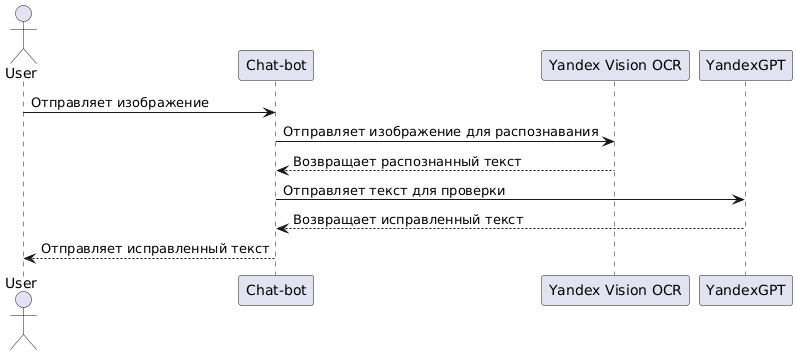

**Доп информация**
- Прежде чем начать работу, вам надо заполнить токены в env.Example и переименовать его в env.py
- Вы можете поставить себе неограниченное количество запросов в фаиле с вашим айди. Нужно выбрать строку "status" : "user" и вместо user ввести admin

# Распознавание и коррекция рукописного текста

Этот проект демонстрирует взаимодействие между Telegram-ботом и Yandex-сервисами для обработки изображений с рукописным текстом.

## Логика работы

1. Пользователь отправляет изображение с рукописным текстом в бота.
2. Бот пересылает изображение в **Yandex Vision OCR** для распознавания текста.
3. Полученный текст отправляется в **YandexGPT** для проверки и исправления ошибок.
4. Исправленный текст возвращается пользователю.

## UML-диаграмма процесса

## 🤖 Попробовать в Telegram

Напишите моему боту: [@Matvey20_bot](https://t.me/Matvey20_bot)

---

## ⚙️ Используемые технологии

- **Python** — логика Telegram-бота
- **Yandex Vision API** — распознавание рукописного текста
- **YandexGPT API** — проверки и коррекция текста
